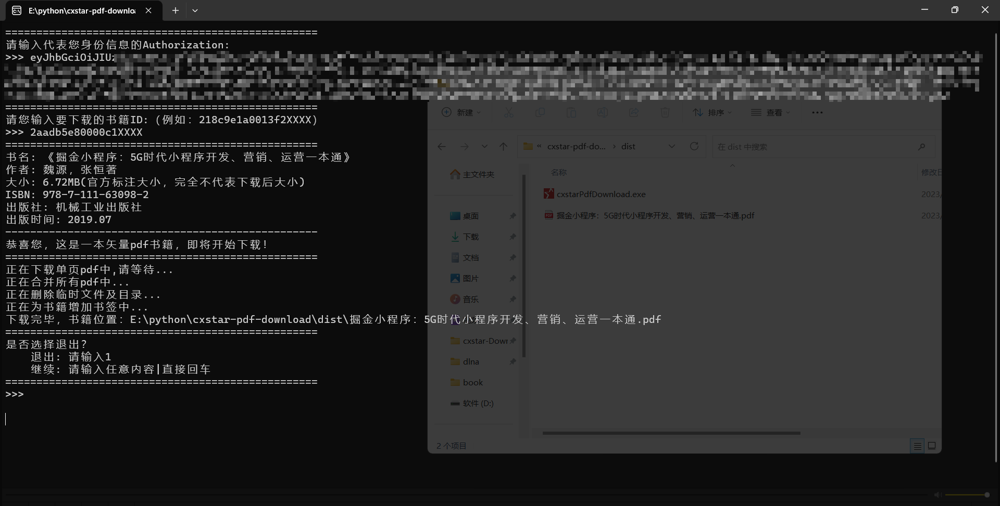

<h2 align="center">
    <p></p>
    <a href="https://github.com/52beijixing/cxstar-pdf-download">Cxstar PDF Download</a>
</h2>

<p align="center">
    帮助您下载畅想之星您有权限阅读的pdf书籍
</p>

<p align="center">
    <a href="https://github.com/52beijixing/cxstar-pdf-download">
        
    </a>
</p>


## 使用须知
### 获取Authorization（需要先登录）
1、打开【浏览器调试工具】(一般是按F12）

2、选择【控制台】（Console）

3、输入下面代码并回车就会自己复制到粘贴板

```
copy(document.cookie.match(/token=([^;]+)/)[1])
```

### 获取书籍id
* PC网页

    `https://www.cxstar.com/Book/Detail?ruid=29e2af210001a5XXXX&packageruid=` 中ruid对应的参数
`29e2af210001a5XXXX` 就是书籍id


* 手机网页

    `https://m.cxstar.com/book/29e2af210001a5XXXX` 中 `29e2af210001a5XXXX` 就是书籍id


## 使用方法
### 1、直接下载打包好的exe文件
https://github.com/52beijixing/cxstar-pdf-download/releases

### 2、本地使用python运行
1、下载项目文件
```
git clone https://github.com/52beijixing/cxstar-pdf-download
```
2、进入项目代码路径
```
cd cxstar-pdf-download
```

3、安装环境依赖
```
pip install -U -r requirements.txt
```

4、运行项目
```
python main.py
```

## 注意
* Authorization有效但是没有权限观看全书时，会下载试看部分的内容

* 下载下来的文件都是虚大的，本人没有能力进行PDF优化，但是您可以通过 `Adobe Acrobat Pro`
或者 `福昕高级PDF编辑器` 进行PDF压缩（PDF优化），您也可以通过其他类似工具进行压缩（优化），
大约能达到很接近官方的文件大小，清晰度也几乎没有区别

* 建议不要特别下载次数特别频繁（一天10来本完全没问题）

